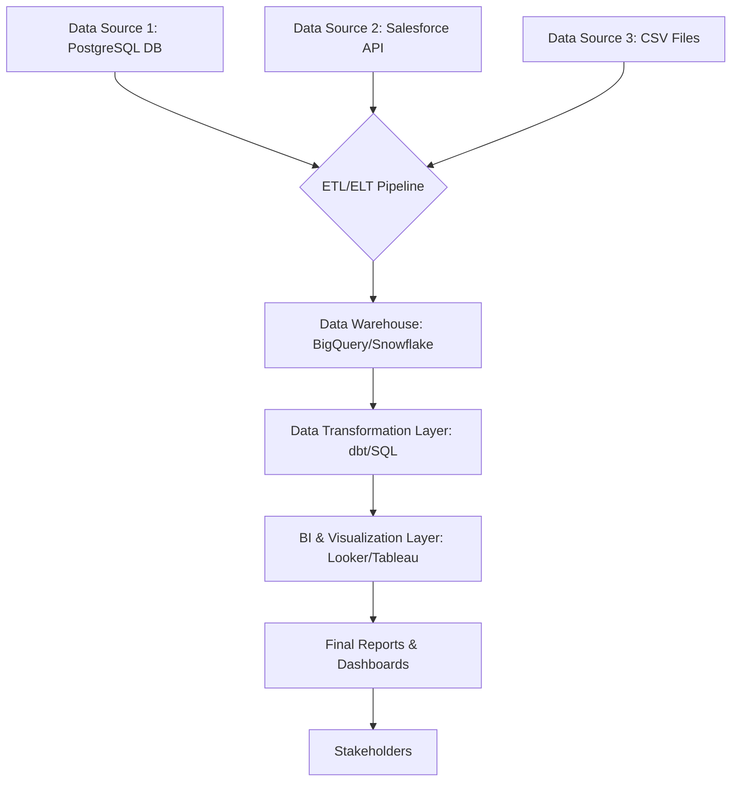

# ixtech Reporting Structure & Automation Project

*Automated reporting and analytics pipeline for business intelligence at ixtech.*

**Version:** 0.1.0
**Last Updated:** September 15, 2025
**Status:** In Development

## 1\. Overview

This project aims to develop a robust, scalable, and automated reporting structure for ixtech. The primary goal is to centralize data from various sources, process it efficiently, and generate insightful reports and dashboards for key stakeholders. This will enable data-driven decision-making, improve operational efficiency, and provide a single source of truth for performance metrics.

This repository contains all the necessary code, queries, configuration files, and documentation related to the project.

## 2\. Reporting Structure Diagram

*(Optional but highly recommended. You can create a diagram using a tool like Mermaid, Lucidchart, or draw.io and embed the image here.)*



*A simplified example of the data flow.*

## 3\. Tech Stack

  * **Data Sources:** [e.g., PostgreSQL, Salesforce, Google Analytics, Stripe API]
  * **ETL/ELT Tool:** [e.g., Fivetran, Airbyte, custom Python scripts]
  * **Data Warehouse:** [e.g., Google BigQuery, Snowflake, Amazon Redshift]
  * **Data Transformation:** [e.g., dbt, custom SQL scripts]
  * **BI & Visualization:** [e.g., Tableau, Looker, Power BI, Metabase]
  * **Orchestration:** [e.g., Airflow, Prefect, Dagster]
  * **Version Control:** Git & GitHub/GitLab

## 4\. Getting Started

### Prerequisites

  - [List any required software, e.g., Python 3.9+, Docker, dbt CLI]
  - [List any required access, e.g., Access to the data warehouse, API keys]

### Installation & Setup

1.  **Clone the repository:**

    ```bash
    git clone [your-repository-url]
    cd [repository-name]
    ```

2.  **Set up environment variables:**

      - Create a `.env` file from the `env.example` template.
      - Populate the `.env` file with the necessary credentials and configuration details (e.g., `DB_USER`, `DB_PASSWORD`, `API_KEY`).
      - **Note:** Never commit the `.env` file to version control.

3.  **Install dependencies:**

    ```bash
    # Example for a Python project
    pip install -r requirements.txt
    ```

4.  **Run initial setup:**

    ```bash
    # Example for a dbt project
    dbt deps
    dbt seed
    ```

## 5\. Usage

Describe how to run the reporting process.

**To run the full pipeline:**

```bash
# Example command
python main.py --run-all
```

**To run a specific report model:**

```bash
# Example for dbt
dbt run --select my_specific_report_model
```

## 6\. Project Structure

```
.
├── data/                    # Sample data, seeds, etc.
├── dbt/                     # dbt project folder (or other transformation tool)
│   ├── models/              # SQL models for transformations
│   └── ...
├── notebooks/               # Jupyter notebooks for exploration and analysis
├── scripts/                 # Python/Bash scripts for ETL, automation
├── reports/                 # Output folder for generated static reports (e.g., CSV, PDF)
├── tests/                   # Data and code tests
├── .env.example             # Example environment file
├── .gitignore               # Files to ignore in git
├── README.md                # This file
└── requirements.txt         # Python dependencies
```

-----

## 🚧 TODO List 🚧

  - [ ] **1. Review and execute .md files for setup.
## 7\. Contributing

Please read `CONTRIBUTING.md` for details on our code of conduct and the process for submitting pull requests.

## 8\. License

This project is licensed under the [Your License, e.g., MIT, Apache 2.0] License - see the `LICENSE.md` file for details.
